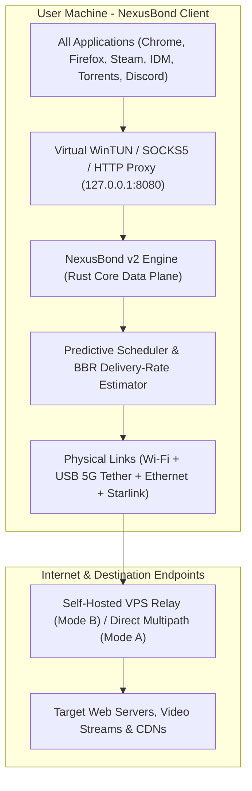

# NexusBond 🌐⚡
### High-Performance Multi-WAN Network Bonding & Aggregation Engine (v2.0)

[](https://opensource.org/licenses/MIT)
[](https://github.com/ali-zafar-awan/NexusBond)
[](https://www.rust-lang.org/)
[](https://react.dev/)
[](https://www.typescriptlang.org/)
[](https://www.python.org/)
[](https://github.com/ali-zafar-awan/NexusBond)
[](https://github.com/ali-zafar-awan/NexusBond)

> **GitHub Repository:** [https://github.com/ali-zafar-awan/NexusBond](https://github.com/ali-zafar-awan/NexusBond)

---

## 📌 What is NexusBond?

**NexusBond** combines 2 to 8 concurrent internet connections (Ethernet, Wi-Fi, 4G/5G USB cellular tethering, Starlink) into **one single virtual high-speed pipeline** for your entire operating system.

For example, links of **20 + 30 + 50 Mbps** appear to your computer, browsers, games, download managers, and speed-test sites as a single bonded stream of **~95 Mbps** with sub-second seamless failover and zero paid subscriptions.



---

## 📑 Table of Contents
1. [Prerequisites](#-prerequisites)
2. [Installation Guide](#-installation-guide-from-github)
   - [Windows Setup](#1-windows-installation-10--11)
   - [Linux Setup](#2-linux-installation-ubuntudebianarchfedora)
   - [macOS Setup](#3-macos-installation)
3. [Quick Start & Stop Guide](#-quick-start--stop-guide)
4. [How to Route Your System & Browsers](#-how-to-route-windows-laptops--browsers)
5. [Detailed UI Feature Walkthrough](#-detailed-ui-feature-guide)
6. [Operational Modes](#-operational-modes)
7. [Developer & Testing Guide](#-developer--testing-guide)
8. [License](#-license)

---

## 📋 Prerequisites

Before installing, ensure your system has the following tools installed:

| Prerequisite | Minimum Version | Installation Link |
| :--- | :--- | :--- |
| **Git** | `2.x+` | [git-scm.com](https://git-scm.com/downloads) |
| **Python** | `3.10+` | [python.org](https://www.python.org/downloads/) *(Ensure "Add to PATH" is checked)* |
| **Node.js & npm** | `18.x+` | [nodejs.org](https://nodejs.org/) *(LTS version recommended)* |
| **Rust & Cargo** | `1.75+` *(Optional for building native crates)* | [rustup.rs](https://rustup.rs/) |

---

## 📥 Installation Guide (From GitHub)

### 1. Clone the Repository
Open PowerShell, Terminal, or Command Prompt:
```bash
git clone https://github.com/ali-zafar-awan/NexusBond.git
cd NexusBond
```

---

### 2. Windows Installation (10 / 11)

#### Step A: Install Python Dependencies
```powershell
python -m pip install --upgrade pip
pip install -r core_engine/requirements.txt
```

#### Step B: Install UI Dependencies & Build Frontend
```powershell
cd ui
npm install
npm run build
cd ..
```

#### Step C: (Optional) Compile Rust Crates
If you want to build the native high-performance Rust core:
```powershell
cargo test --workspace
cargo build --release --workspace
```

---

### 3. Linux Installation (Ubuntu / Debian / Arch / Fedora)

#### Step A: Install System Dependencies (Ubuntu/Debian)
```bash
sudo apt update
sudo apt install -y git python3 python3-pip python3-venv nodejs npm build-essential
```

#### Step B: Set Up Python Virtual Environment
```bash
python3 -m venv venv
source venv/bin/activate
pip install -r core_engine/requirements.txt
```

#### Step C: Install UI Dependencies
```bash
cd ui
npm install
npm run build
cd ..
```

---

### 4. macOS Installation

```bash
# Install Node and Python via Homebrew
brew install node python git

# Set up Python environment
python3 -m venv venv
source venv/bin/activate
pip install -r core_engine/requirements.txt

# Install UI Dependencies
cd ui
npm install
npm run build
cd ..
```

---

## ⚡ Quick Start & Stop Guide

### 🚀 1. Run Everything in 1-Click (Windows)
Double-click [`scripts/start-all.bat`](file:///d:/NexusBond/scripts/start-all.bat) or run from PowerShell:
```powershell
d:\NexusBond\scripts\start-all.bat
```

**What happens automatically:**
1. Starts the **NexusBond Core Engine** (port `5000`, SOCKS5 `1080`, HTTP `8080`).
2. Starts the **Dashboard UI Web Server** at [**http://localhost:5173**](http://localhost:5173).
3. **Automatically Enables Windows System Proxy** (`127.0.0.1:8080`) so all your browsers (Chrome, Edge, Firefox, Brave), video streaming, fast.com, and downloads **immediately aggregate across all links with zero manual setup**!

---

### 🛑 2. Turn Off Everything in 1-Click
Double-click [`scripts/stop-all.bat`](file:///d:/NexusBond/scripts/stop-all.bat) or run:
```powershell
d:\NexusBond\scripts\stop-all.bat
```

**What happens automatically:**
- Cleanly shuts down the Engine and UI servers.
- **Automatically Disables Windows System Proxy** and restores standard direct network routing.
- Resets Windows network adapter metrics to default.

---

### 🎛️ 3. Manual Proxy Toggle Scripts (Standalone)
If you wish to toggle the Windows proxy independently without stopping the servers:
- **Enable Proxy Manually:** Double-click [`scripts/enable-windows-proxy.bat`](file:///d:/NexusBond/scripts/enable-windows-proxy.bat)
- **Disable Proxy Manually:** Double-click [`scripts/disable-windows-proxy.bat`](file:///d:/NexusBond/scripts/disable-windows-proxy.bat)

---

### 🐧 4. Running Manually via Terminal (Linux / macOS / CLI)

**Terminal 1 (Backend Core Engine):**
```bash
python -m core_engine.main
```

**Terminal 2 (React Frontend UI):**
```bash
cd ui
npm run dev -- --host 127.0.0.1 --port 5173
```

- **Dashboard UI**: [**http://localhost:5173**](http://localhost:5173)
- **Control API**: `http://127.0.0.1:5000`
- **SOCKS5 Multi-WAN Proxy**: `127.0.0.1:1080`
- **HTTP/HTTPS Proxy**: `127.0.0.1:8080`

---

## 🌐 How to Route Windows, Laptops & Browsers

To ensure all applications use your bonded bandwidth:

### 💻 Method 1: 1-Click Windows System Proxy (Recommended)
- **Turn On:** Double-click [`scripts/enable-windows-proxy.bat`](file:///d:/NexusBond/scripts/enable-windows-proxy.bat)
- **Turn Off:** Double-click [`scripts/disable-windows-proxy.bat`](file:///d:/NexusBond/scripts/disable-windows-proxy.bat)

### 🖥️ Method 2: Windows Manual GUI Configuration (Win 10 & 11)
1. Open **Windows Settings** (`Win + I`) ➔ **Network & Internet** ➔ **Proxy**.
2. Under **Manual proxy setup**, click **Set up** on *Use a proxy server*.
3. Turn **Use a proxy server** to **ON**.
4. Set **Proxy IP address**: `127.0.0.1` and **Port**: `8080`.
5. Check *"Don't use the proxy server for local (intranet) addresses"* and click **Save**.

### 🌍 Method 3: Web Browsers (Chrome, Edge, Firefox, Brave)
- **Chrome / Edge / Brave:** Automatically follow Windows System Proxy settings.
- **Mozilla Firefox:**
  1. Go to **Settings** ➔ Search **Network Settings** ➔ Click **Settings...**
  2. Choose **Manual proxy configuration**.
  3. Set **SOCKS Host**: `127.0.0.1`, **Port**: `1080`, Type: `SOCKS v5`.
  4. Check **Proxy DNS when using SOCKS v5** ➔ Click **OK**.

### 🚀 Method 4: Download Accelerators (IDM & Torrents)
- **Internet Download Manager (IDM):**
  1. Go to **Options** ➔ **Proxy / Socks** tab ➔ Check **Use SOCKS** ➔ Server: `127.0.0.1`, Port: `1080`.
  2. In the **Connection** tab, set *Connection Type/Speed* to **High Speed** and set *Max Connection Number* to **16 or 32**. IDM will split downloads into 32 simultaneous parts striped across all your bonded adapters!
- **qBittorrent:** *Tools > Options > Connection > Proxy Server* ➔ Type: `SOCKS5`, Host: `127.0.0.1`, Port: `1080`.

### 💻 Method 5: Terminal / Developer Environment (cURL, Git, Python)
```powershell
$env:ALL_PROXY = "socks5://127.0.0.1:1080"
$env:HTTP_PROXY = "http://127.0.0.1:8080"
$env:HTTPS_PROXY = "http://127.0.0.1:8080"
```

---

## 📖 Detailed UI Feature Guide

The NexusBond Control Center is divided into an intuitive top navigation bar, quick-action modals, and 5 dedicated operational tabs:

```
┌────────────────────────────────────────────────────────────────────────────────────────┐
│  🌐 NexusBond v2.0   [ Mode: Auto ▾ ]   [ Kill Switch: OFF ]   [ Speed Test ]  [ Setup ] │
├────────────────────────────────────────────────────────────────────────────────────────┤
│  [ 📊 Overview ]  [ 🔌 Adapters ]  [ 🌐 Relays ]  [ 🛡️ Diagnostics ]  [ 📜 Audit Logs ]  │
└────────────────────────────────────────────────────────────────────────────────────────┘
```

### 1. 🧭 Top Navigation & Global Controls
- **`Mode Selector`**: Toggle between `Auto`, `Mode A (Local Smart Dispatch)`, `Mode B (VPS Relay Tunnel)`, and `Mode C (Redundant Failover)`.
- **`Kill Switch`**: 1-click protection that instantly blocks all direct, unbonded internet access to prevent IP/DNS leaks during link drops.
- **`Speed Test`**: Real simultaneous multi-socket download benchmark across all active adapters with **zero simulated numbers**.
- **`Setup Wizard`**: 3-step onboarding for detecting connected adapters, calibrating pings, and selecting bonding profiles.
- **`Settings`**: Configure proxy ports, Forward Error Correction (FEC), and parallel DNS racing servers.

### 2. 📊 Tab 1: Overview Dashboard
- **Aggregated Speedometer**: Live total download (**Rx**) and upload (**Tx**) throughput across all combined links in Mbps.
- **Multi-Series Traffic Graph**: Real-time SVG timeline chart showing individual adapter throughput curves and total aggregated speed.
- **Active Physical Adapters Cards**: Real-time cards showing dynamic WRR weights, ping latency (EWMA), packet loss %, and instant on/off toggles.

### 3. 🔌 Tab 2: Network Interface Management
- **Custom Friendly Aliases**: Rename adapters (e.g. *"Home Fiber 100M"*, *"Mobile 5G Tether"*).
- **Priority Tiering (1 to 5)**: Assign primary vs. secondary overflow interfaces.
- **Backup Only (Standby Mode)**: Keeps cellular links idle to conserve mobile data until primary connections fail.
- **Monthly Data Cap & Metered Limits**: Enforce cellular data quotas in Megabytes (MB).

### 4. 🌐 Tab 3: Mode B VPS Relay Manager
- **Add Custom VPS Relays**: Configure host, port (`51820`), and Noise_IK public keys.
- **Live Ping Latency Test**: One-click socket latency probe to test VPS connectivity.
- **Active Relay Selection**: Select which remote server handles your bonded single-connection traffic.

### 5. 🛡️ Tab 4: Security & Diagnostics
- **DNS Leak Protection**: Verifies DNS queries do not bypass NexusBond to ISP default resolvers.
- **IPv6 Leak Protection**: Ensures unbonded IPv6 traffic does not expose your real IP.
- **Shared Upstream / Subnet Collision Detector**: Detects if two connected adapters share the same gateway router.

### 6. 📜 Tab 5: Real-Time Audit Logs
- Continuous audit trail of hot-plug detections, sub-second failovers, stream migrations, and link health alerts.

---

## ⚙️ Operational Modes

| Mode | Target Use Case | VPS Server Required? | Single-Stream Bonding? | Multi-Stream Bonding? |
| :--- | :--- | :--- | :--- | :--- |
| **Mode A: Smart Dispatch** | Web browsing, multi-tab video, game updates, downloads | **No (100% Local)** | No (capped at fastest link) | **Yes (Full sum of all links)** |
| **Mode B: Bonding Tunnel** | Single-connection speed tests, single TCP streams, live broadcast | **Optional (Free Self-Hosted)** | **Yes (e.g. 50 + 50 = 100 Mbps)** | **Yes (Full sum of all links)** |
| **Mode C: Redundancy** | Low-latency competitive gaming, live VoIP / Discord | **No / Optional** | Packet duplication | Zero packet loss |

---

## 🧪 Developer & Testing Guide

### Run Rust Workspace Unit & Fuzz Tests
```powershell
cargo test --workspace
```

### Run Python Core Engine Regression Tests
```powershell
python -m pytest -v
```

### Build Production Web UI Bundle
```powershell
cd ui
npm run build
```

---

## 📄 License & Repository

- **Repository:** [https://github.com/ali-zafar-awan/NexusBond](https://github.com/ali-zafar-awan/NexusBond)
- **License:** [MIT License](https://opensource.org/licenses/MIT) - 100% Free, Open Source, and Zero Telemetry.
